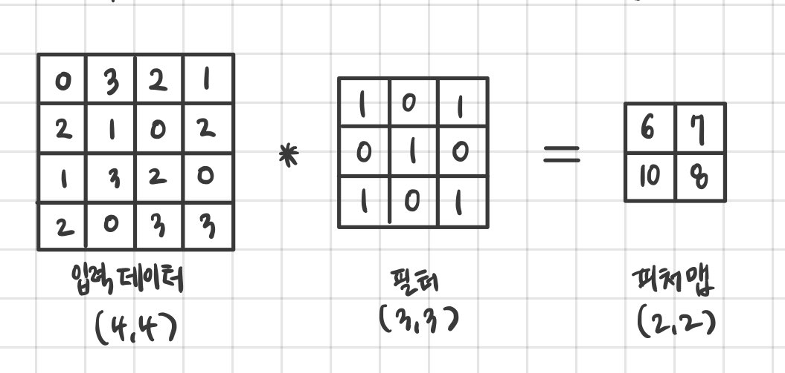
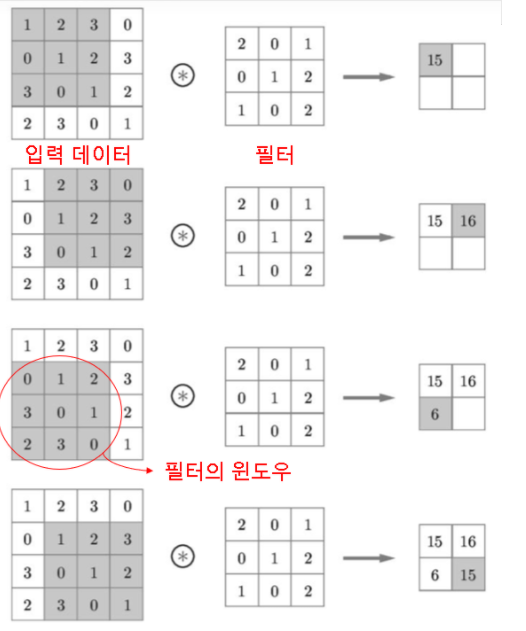
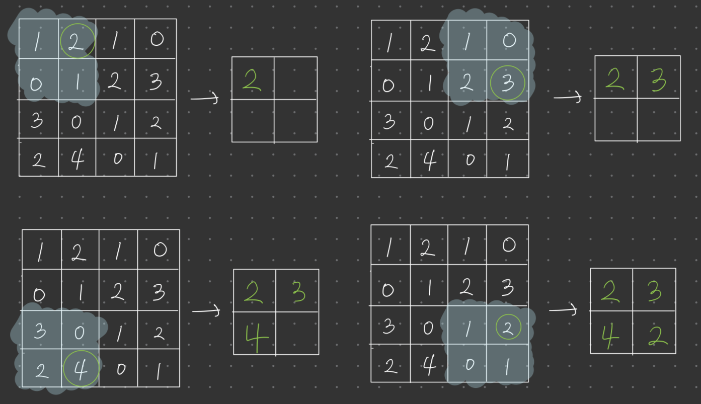

### CNN
CNN에서는 **패딩**, **스트라이드** 등 CNN의 고유 용어가 등장합니다. 또한 각 계층 사이에는 3차원 데이터같이 입체적인 데이터가 흐른다는 점에서 완전연결 신경망과는 다릅니다.

### 완전연결계층(Affine계층)의 문제점
완전 연결 계층의 경우, 인접하는 계층의 뉴런이 모두 연결되고 출력의 수는 임의로 정할 수 있습니다. 이러한 완전 연결 계층의 문제점은 **데이터의 형상이 무시된다**는 것입니다. 입력 데이터가 이미지인 경우를 예로 들면, 이미지는 (세로, 가로, 채널(색상))로 구성된 3차원 데이터입니다. 그러나 완전연결 계층에 입력할 때는 3차원 데이터를 평평한 1차원 데이터로 평탄화(Flatten)해줘야 합니다. 이전까지의 MNIST데이터셋을 사용한 사례에서는 형상이 (1, 28, 28)인 이미지(1채널, 세로 28픽셀, 가로 28픽셀)를 1줄로 세운 784개의 데이터를 첫 Affine 계층에 입력했습니다.

### 합성곱 연산
합성곱 계층에서의 합성곱 연산을 처리합니다. 합성곱 연산은 이미지 처리에서 말하는 필터연산에 해당합니다.
 
위 예시에서 입력은 (4, 4), 필터는(3, 3), 출력은 (2, 2)의 형상을 갖게 됩니다. 문헌에 따라 필터를 커널이라 칭하기도 합니다.  
합성곱 연산은 필터의 윈도우를 일정 간격으로 이동해가며 입력 데이터를 적용합니다.
아래는 합성곱 연산 순서입니다.  
  
합성곱에서도 편향은 존재합니다. 편향은 출력된 모든 요소에 편향값을 더해 사용합니다.

### 패딩
합성곱 연산을 수행하기 전에 입력 데이터 주변을 특정 값(주로 0)으로 채우기도 합니다. 이를 패딩이라 하며, 합성곱 연산에서 자주 이용하는 기법입니다. 이를테면 (4, 4)크기의 입력값 주변을 모두 0으로 채우는 행위를 말합니다. 이렇게 패딩이 추가된 입력값은 (4, 4)의 형상에서 (6, 6)의 형상으로 변경됩니다. 패딩이 추가된 입력에 따라, 출력도 (2, 2)의 형상에서 (4, 4)의 형상으로 변경됩니다. 

### 스트라이드
필터를 적용하는 위치의 간격을 스트라이드라고 합니다. 합성곱 연산 순서의 간격을 보면 스트라이드가 1인 것을 확인할 수 있지만, 스트라이드를 2로 하면 다음 연산을 수행할 때 2칸씩 건너 뛸 수 있습니다. 하지만 크기의 형상은 (3, 3)으로 줄어듭니다((4, 4)형상의 입력에 패딩을 적용하여 스트라이드를 2라고 가정했을 때). 패딩을 적용했을 때 출력값의 형상이 늘어났지만, 스트라이드를 추가해버리니 출력의 크기가 줄었습니다. 이러한 관계를 수식화 해봅니다.

> 입력 크기를 (H, W), 필터 크기를(FH, FW), 출력 크기를(OH, OW), 패딩의 크기를 P, 스트라이드를 S라 하면 아래 식처럼 출력 크기를 계산합니다.  
> OH = ((H + 2P - FH) / S) + 1  
> OW = ((W + 2P - FW) / S) + 1

### 풀링계층
풀링은 세로*가로 방향의 공간을 줄이는 연산입니다. 예를 들면 (4, 4)형상의 공간을 (2, 2)공간으로 집약합니다. 아래는 최대 풀링을 스트라이드2로 처리하는 예시입니다.  

풀링계층의 특징으로는 아래와 같은 특징들이 있습니다.

|특징|설명|
|---|---|
|학습해야 할 매개변수가 없다|풀링 계층은 합성곱 계층과 달리 학습해야 할 매개변수가 없습니다.   풀링은 대상 영역에서 최댓값이나 평균을 취하는 명확한 처리이므로 특별히 학습할 것이 없습니다.|
|채널 수가 변하지 않는다.|풀링 연산은 입력 데이터의 채널 수 그대로 출력 데이터로 내보냅니다.  채널마다 독립적으로 계산하기 때문입니다.|
|입력의 변화에 영향을 적게 받는다|입력데이터가 조금 변해도 풀링의 결과는 잘 변하지 않습니다.|