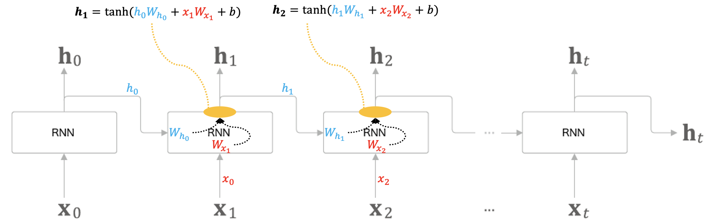
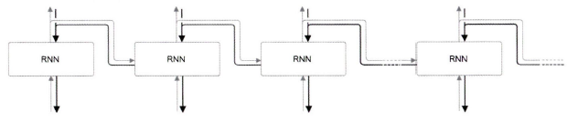

### RNN(Recurrent Neural Network / Recursive Neural Network)
순환 신경망은 일반적인 feed forward 형태의 신경망들과는 다른 형태를 띠고 있다. 이전 시점의 은닉층의 출력값을 출력층에도 보내되, 다음 층의 은닉층에도 보내며 `순환`하는 형태를 띠고 있다. 이러한 점에서 **순환신경망** 혹은 **재귀신경망** 이라고도 한다.

### 순환구조 살펴보기
순환 신경망이 순환하는 구조는 아래와 같다.

오른쪽으로 성장하는 일자로 긴 신경망의 구조이다. 지속적으로 한 방향으로 흐르기에 feed forward 방식과 비슷하다고 생각할 수 있지만, 다수의 RNN계층 모두가 실제로는 **같은 계층**인 것이 일반적인 신경망과는 다른 점이다.

위의 그림으로부터 알 수 있는 사실은, 각 시점의 RNN 계층은 그 계층으로의 입력과 직전 시점의 RNN계층으로부터의 출력을 받는다.

각 출력식을 살펴보면, 2개의 가중치와 편향값을 찾을 수 있다. 행렬 곱을 계산하고, 그 합을 tanh 함수를 이용해 활성화한다. 이 결과는 그 시점 t의 출력인 ht가 된다. 이 ht는 다른 계층을 향해 위쪽으로 출력되는 동시에 다음 시점의 RNN계층(자기 자신)을 향해 오른쪽으로도 출력된다.

각 계산식을 자세히 보면, ht시점의 계산은 한 시점 이전의 출력인 ht-1에 기초해 계산됨을 알 수 있다. 다른 관점으로 보면, RNN은 h라는 **상태**를 가지고 있으며, 계산식을 통해 갱신된다. 그래서 RNN층을 상태를 가지는 계층 혹은 메모리 계층이라고도 한다.

### RNN 계층의 오차 역전파(Back Propagation Through Time)
RNN 계층의 오차 역전파법은 아래 그림과 같이 진행된다.

여기서의 오차 역전파법은 "시간 방향으로 펼친 신경망의 오차 역전파법"이란 뜻으로 BPTT라고 한다. 하지만 이는 문제점이 하나 존재하는데, 긴 시퀀스 데이터에 대해서 연산 시 기울기가 불안정해지거나 소실되는는 문제가 있다. 이러한 문제를 대비해 고안해낸 방법이 **Truncated BPTT**이다

### Truncated BPTT
일반적인 BPTT와는 달리, 킨 시퀀스 데이터에 대해 적당한 지점에서 연결을 끊어 작은 신경망 여러개로 만든 다음 작은 각 신경망에 대해 BPTT를 수행한다.

주의할 점은, **역전파의 연결**만 끊어야 한다는 것이다. 순전파의 연결은 반드시 그대로 유지해야 한다.

RNN계층을 길이 10개 단위로 학습할 수 있도록 역전파의 연결을 끊는다. 이처럼 역전파의 연결을 잘라내면 그보다 미래의 데이터에 대해서는 생각할 필요가 없다. 따라서 각각의 블록 단위로 미래의 블록과는 독립적으로 오차 역전파법을 완결시킬 수 있다.