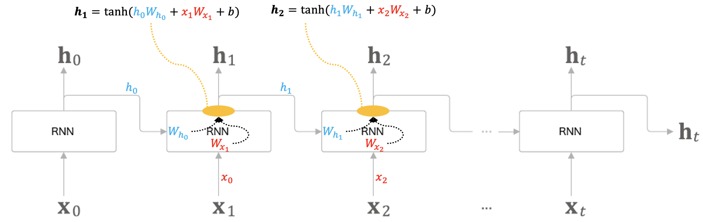
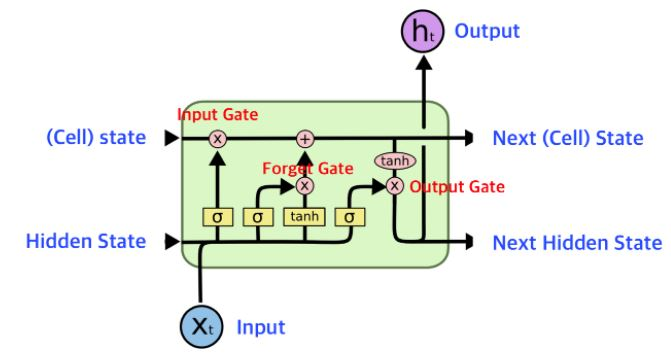

### RNN(Recurrent Neural Network / Recursive Neural Network)
순환 신경망은 일반적인 feed forward 형태의 신경망들과는 다른 형태를 띠고 있다. 이전 시점의 은닉층의 출력값을 출력층에도 보내되, 다음 층의 은닉층에도 보내며 `순환`하는 형태를 띠고 있다. 이러한 점에서 **순환신경망** 혹은 **재귀신경망** 이라고도 한다.

### 순환구조 살펴보기
순환 신경망이 순환하는 구조는 아래와 같다.

오른쪽으로 성장하는 일자로 긴 신경망의 구조이다. 지속적으로 한 방향으로 흐르기에 feed forward 방식과 비슷하다고 생각할 수 있지만, 다수의 RNN계층 모두가 실제로는 **같은 계층**인 것이 일반적인 신경망과는 다른 점이다.

위의 그림으로부터 알 수 있는 사실은, 각 시점의 RNN 계층은 그 계층으로의 입력과 직전 시점의 RNN계층으로부터의 출력을 받는다.

각 출력식을 살펴보면, 2개의 가중치와 편향값을 찾을 수 있다. 행렬 곱을 계산하고, 그 합을 tanh 함수를 이용해 활성화한다. 이 결과는 그 시점 t의 출력인 ht가 된다. 이 ht는 다른 계층을 향해 위쪽으로 출력되는 동시에 다음 시점의 RNN계층(자기 자신)을 향해 오른쪽으로도 출력된다.

각 계산식을 자세히 보면, ht시점의 계산은 한 시점 이전의 출력인 ht-1에 기초해 계산됨을 알 수 있다. 다른 관점으로 보면, RNN은 h라는 **상태**를 가지고 있으며, 계산식을 통해 갱신된다. 그래서 RNN층을 상태를 가지는 계층 혹은 메모리 계층이라고도 한다.

### RNN 계층의 오차 역전파(Back Propagation Through Time)
RNN 계층의 오차 역전파법은 아래 그림과 같이 진행된다.

여기서의 오차 역전파법은 "시간 방향으로 펼친 신경망의 오차 역전파법"이란 뜻으로 BPTT라고 한다. 하지만 이는 문제점이 하나 존재하는데, 긴 시퀀스 데이터에 대해서 연산 시 기울기가 불안정해지거나 소실되는는 문제가 있다. 이러한 문제를 대비해 고안해낸 방법이 **Truncated BPTT**이다

### Truncated BPTT
일반적인 BPTT와는 달리, 킨 시퀀스 데이터에 대해 적당한 지점에서 연결을 끊어 작은 신경망 여러개로 만든 다음 작은 각 신경망에 대해 BPTT를 수행한다.

주의할 점은, **역전파의 연결**만 끊어야 한다는 것이다. 순전파의 연결은 반드시 그대로 유지해야 한다.

RNN계층을 길이 10개 단위로 학습할 수 있도록 역전파의 연결을 끊는다. 이처럼 역전파의 연결을 잘라내면 그보다 미래의 데이터에 대해서는 생각할 필요가 없다. 따라서 각각의 블록 단위로 미래의 블록과는 독립적으로 오차 역전파법을 완결시킬 수 있다.

### RNN의 문제점
시퀀스의 길이가 길어질수록 simpleRNN의 경우 멀리 떨어진 시점의 데이터와 관련성을 파악하기 어려워 성능이 떨어지는 단점이있다. 이는 과거 정보가 마지막까지 전달되지 못하는 장기 의존성 문제라고 한다. 이러한 문제가 발생되는 원인은 모델이 복잡할 수록 경사가 기하급수적으로 감소하는 기울기 소실 문제와 기울기가 너무 큰 값이 되면서 나타나는 기울기 폭주 문제로 제대로 된 훈련이 어렵다. 

이러한 문제를 해결하고자 고안된 것이 LSTM(Long Short Term Memory)이다. LSTM은 장단기 메모리를 활용해 잊어야 할 것과 기억해야 할 것을 조절한다.

LSTM의 경우 3개의 **게이트**로 이뤄져 있으며, 아래와 같은 역할들을 한다.

|게이트|설명|
|---|---|
|Forget Gate|망각게이트로, sigmoid함수로 활성화되어 이전 시점의 정보를 다음 시점에 어느정도로 적용할지 결정하는 게이트이다.|
|Input Gate|입력 게이트로, tanh함수를 거쳐 현재 정보를 전달한다. 단, 입력 게이트도 시그모이드로 결과값에 따라 셀 상태에 더할지 말지 결정한다.|
|Output Gate|출력 게이트로, 출력 값을 결정하고 최종 ht(은닉 상태)를 전달한다.|

LSTM의 큰 특징은 셀 상태가 있다는 점이다. 셀 상태는 이전 시점에서 입력된 값을 먼저 망각 게이트를 통해 이전 정보를 지우거나 유지하고, 입력 게이트를 통해 새로운 정보(특성)를 추가한다. 둘로 나누어져 한 쪽은 셀 상태 그대로 출력되고 한쪽은 tanh를 거쳐 출력 게이트 결과 값인 ht에 반영된다.

### LSTM의 한계
셀 구조가 복잡하고 느리다는 단점이 있다. 이를 보완하기 위해 LSTM구조를 단순화한 `GRU`가 제안되었다. LSTM에서 중요한 셀 상태는 은닉 상태에서 그 역할을 대신하며, 망각 게이트와 입력 게이트를 결합한 LSTM의 간소화된 버전이라고 할 수 있다.

GRU는 2개의 게이트가 존재하며, 셀 상태가 별도로 존재하지 않고 Zt(업데이트 게이트)에서 시그모이드 함수를 활용하여 망각 게이트와 입력 게이트를 모두 제어한다. 따라서 망각 게이트와 입력 게이트는 한쪽이 열리면 한쪽이 닫히는 구조이다. 쉽게 말하자면 새로 입력된 정보를 얼마나 반영할지 결정한다. 

Rt는 재설정 게이트(reset gate)라고 하며, 이전 상태와 현재 입력이 연결될 때 이전 상태를 얼마나 반영할지 결정한다.

LSTM과 GRU중 특정 **무언가가 더 우세하다**고 할 수 없지만, 일반적으로 알려진 바에 의하면, 데이터의 양이 조금 더 작으면 GRU가, 양이 많으면 LSTM이 낫다고 하는 편이지만, 데이터와 환경에 따라 달라질 수 있다.